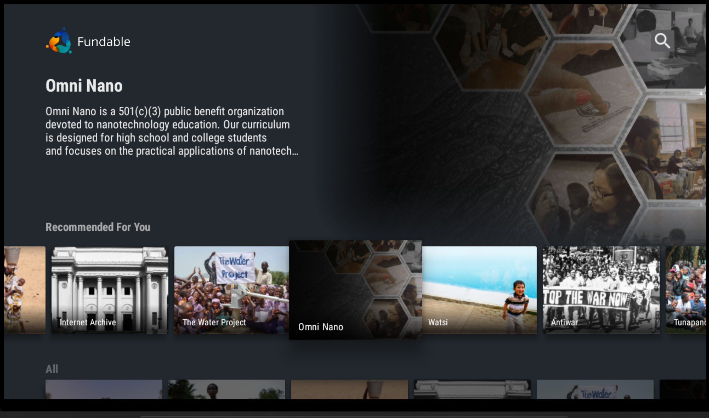
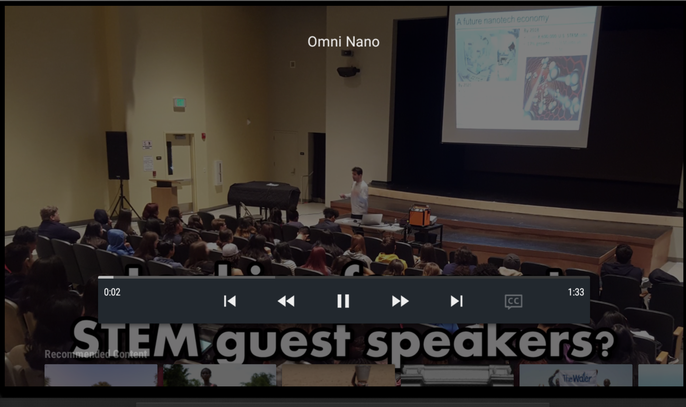
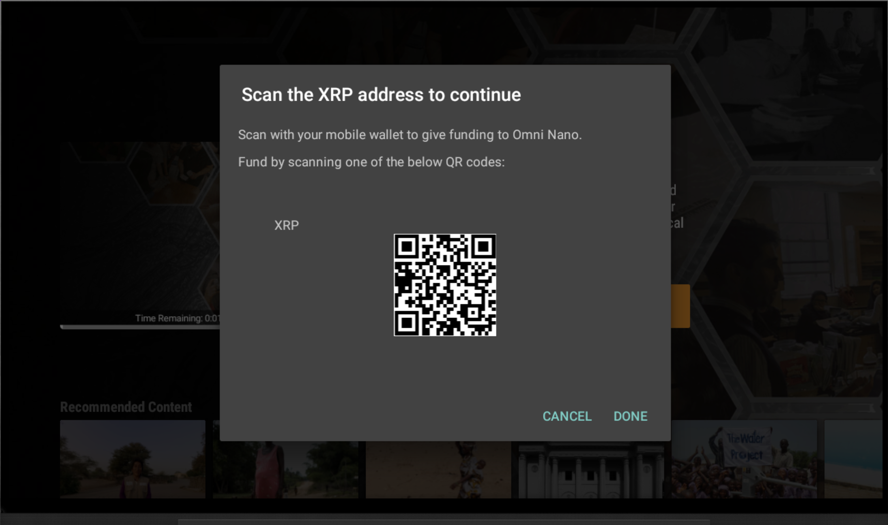

 

Fundable
---

Fundable  - A FireTV app for engaging with live content and supporting content creators such as musicians and streamers.

### Technical
Combination of the Xpring SDK, XRP Testnet, and the XRPL specification (JSON RPC / Websocket). 

### Screenshots

#### Loading

#### Main screen

#### Project detail screen

#### View pitch videos from entrepreneurs.

#### Fund projects that you believe in. Use the unique QR code to pay from your mobile device.

### Dev Notes
* https://xrpl.org/get-started-using-java.html

### Useful links
* https://xrpl.org/xrp-testnet-faucet.html

