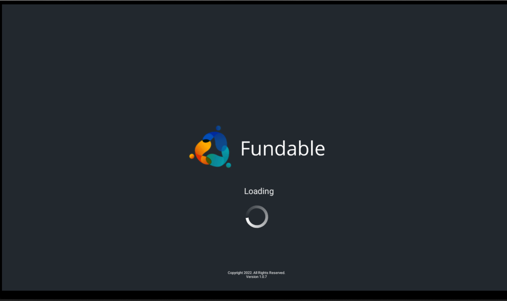
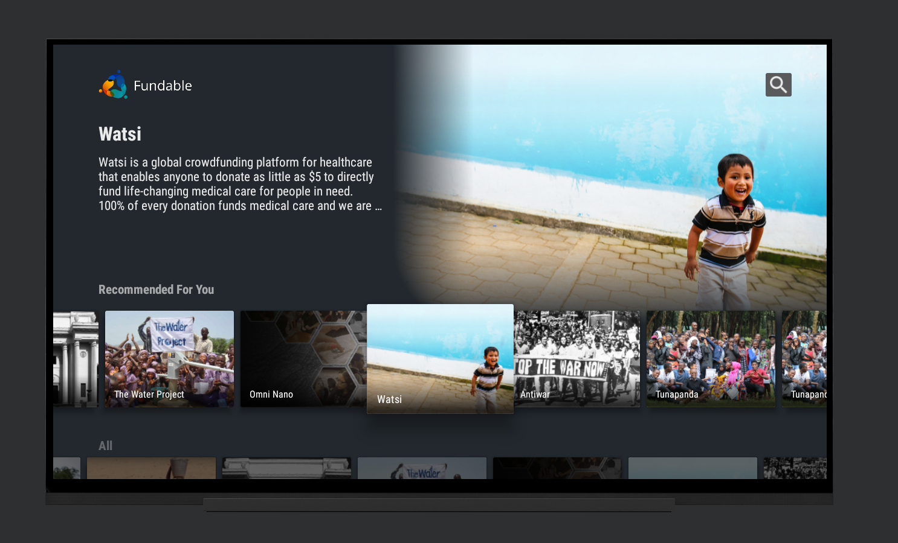
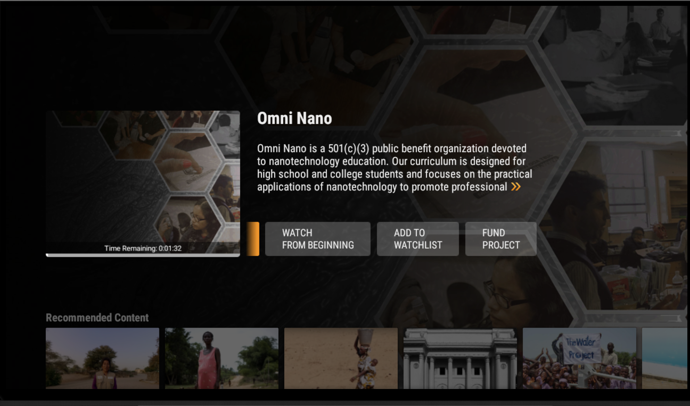
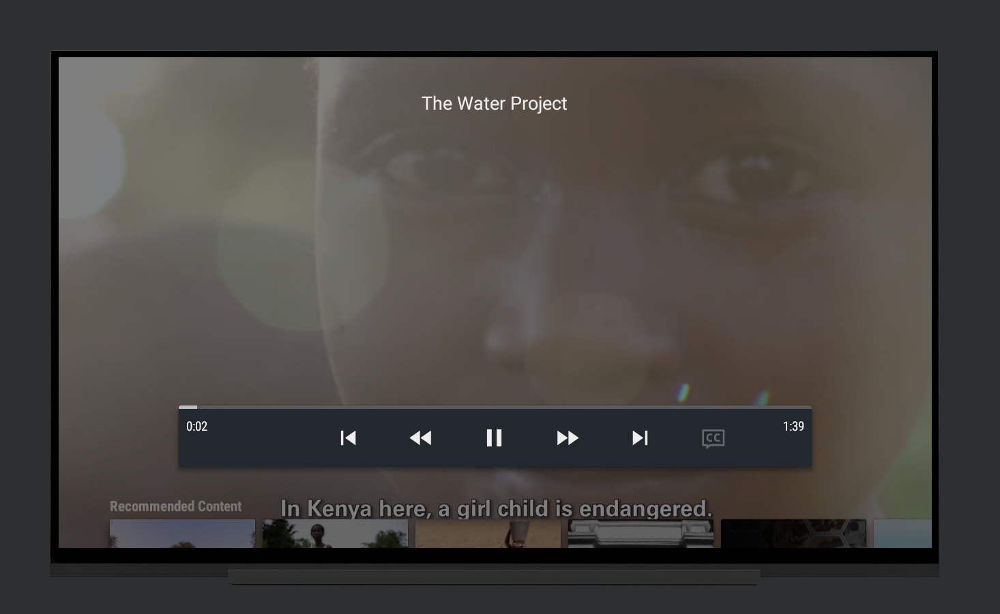
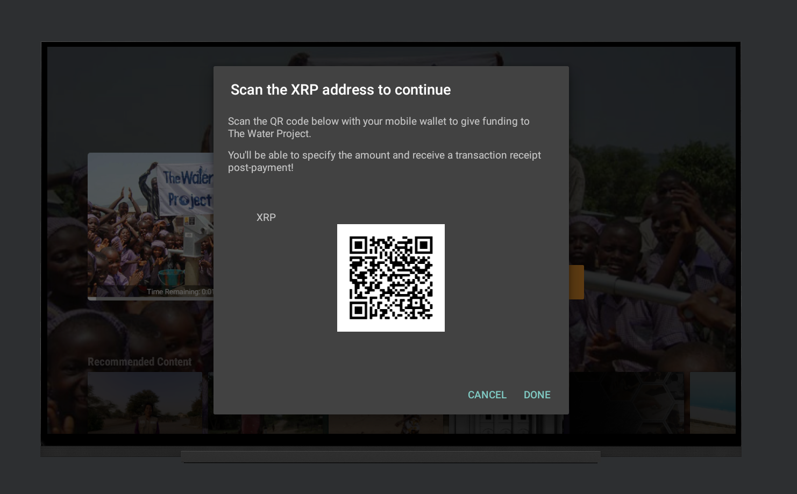
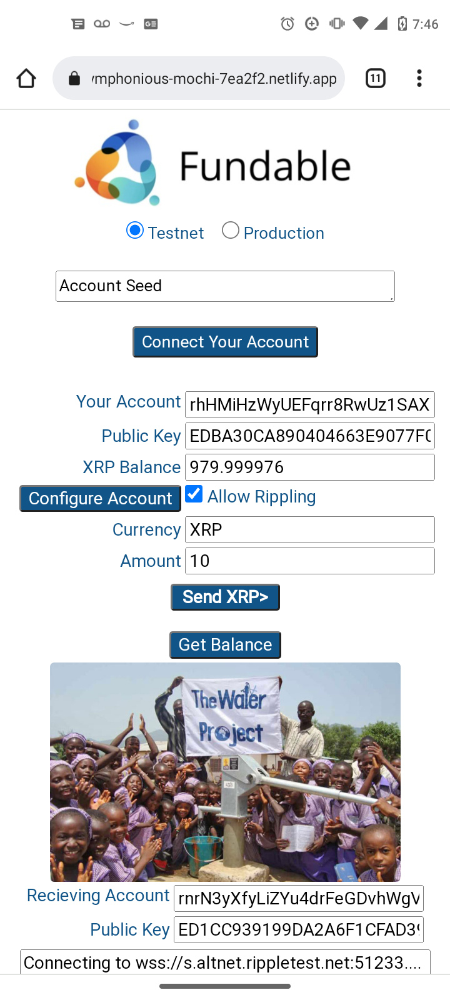
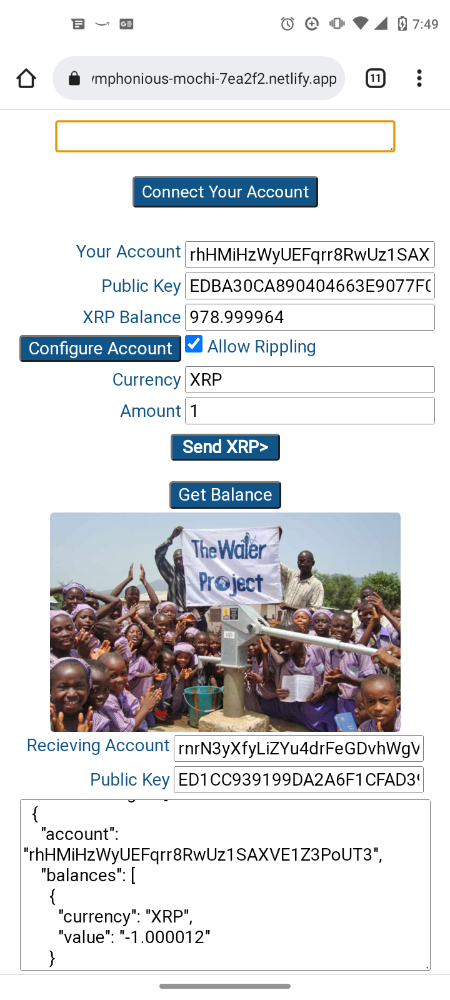

 

Fundable
---

Fundable  - A FireTV app for engaging with live content and supporting content creators such as musicians and streamers.

Built for the <a href="https://xrplimpact.devpost.com/" target="_blank">XRPL Hackathon 2022</a>

### Technical
Combination of the Xpring SDK, XRP Testnet, and the XRPL specification (JSON RPC / Websocket). 

### Screenshots

#### Loading

#### Main project discovery screen

#### Project detail screen

#### View pitch videos from entrepreneurs.

#### Fund projects that you believe in. Use the unique QR code to pay from your mobile device.

#### Complete donations from your mobile device

#### Successful payment

<!--

### Dev Notes
* https://xrpl.org/get-started-using-java.html

### Useful links
* https://xrpl.org/xrp-testnet-faucet.html

-->

